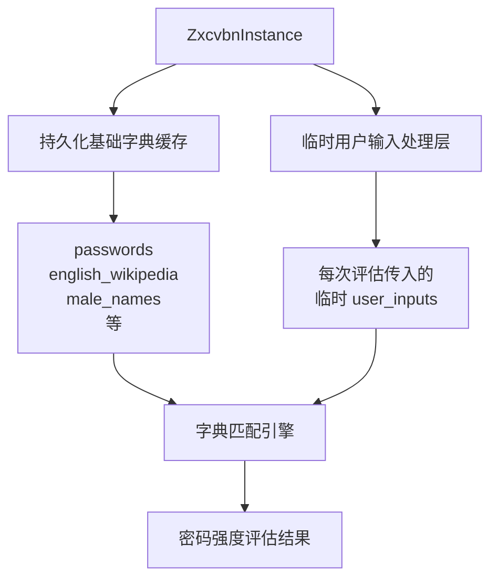
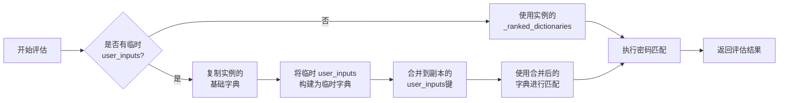
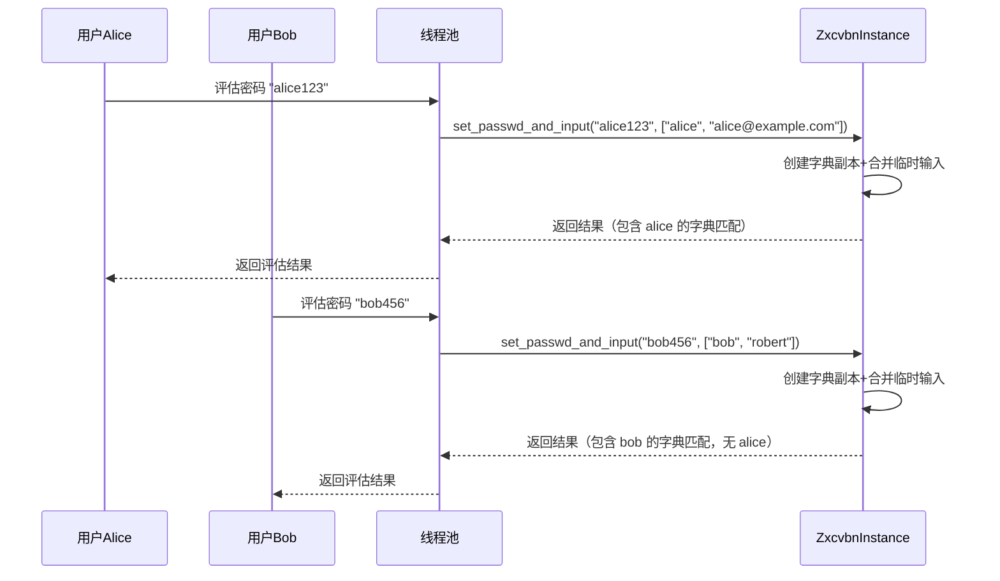
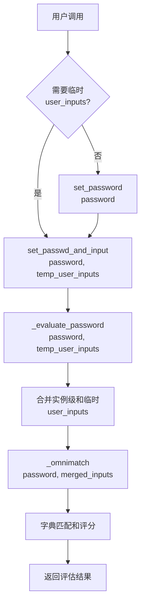

# ZxcvbnInstance 动态用户输入更新机制设计

## 需求概述

为 ZxcvbnInstance 提供在运行时高效且低开销地切换 user_inputs 的能力，支持线程池场景下不同用户的密码评估，确保每个用户的自定义字典（如用户名）仅对当前用户生效，不影响其他用户。

## 核心问题分析

### 当前实现的限制

当前 ZxcvbnInstance 的 user_inputs 处理方式存在以下问题：

1. 初始化时的 user_inputs 会被固化到 `_ranked_dictionaries` 缓存中
2. `update_user_inputs()` 方法会强制重新构建整个字典缓存（通过设置 `_ranked_dictionaries = None`）
3. 在线程池场景下，同一个实例被不同用户调用时，前一个用户的 user_inputs 会污染后续用户的评估结果
4. 频繁的字典重建会带来性能开销

### 使用场景

典型场景：Web应用的线程池模式
- 线程池中有若干个 ZxcvbnInstance 实例
- 不同用户的请求被分配到不同的线程处理
- 每个用户需要将自己的用户名、邮箱等信息加入自定义字典
- 用户A的自定义字典不应该影响用户B的密码评估

## 设计目标

1. 支持每次密码评估时动态传入临时 user_inputs
2. 保持基础字典（passwords、english_wikipedia等）的缓存不变
3. 临时 user_inputs 仅在当前评估生效，不污染实例的持久化状态
4. 保持线程安全性
5. 最小化性能开销

## 解决方案设计

### 方案架构

采用"基础字典缓存 + 临时用户输入"的两层架构：



### 核心机制

#### 1. 字典缓存分层策略

| 层级 | 内容 | 生命周期 | 更新频率 |
|------|------|----------|----------|
| 基础字典层 | passwords、english_wikipedia、姓名等预定义字典 | 实例级别持久化 | 几乎不变 |
| 实例用户输入层 | 初始化时或通过 update_user_inputs() 设置的 user_inputs | 实例级别持久化 | 偶尔更新 |
| 临时用户输入层 | 每次密码评估时传入的临时 user_inputs | 单次评估 | 每次评估都可能不同 |

#### 2. API 设计

新增核心方法和包装方法：

```
set_passwd_and_input(password, temp_user_inputs=None)
set_password(password)
```

方法说明：

| 方法 | 参数 | 职责 | 用途 |
|------|------|------|------|
| `set_passwd_and_input()` | password, temp_user_inputs | 核心实现方法，处理密码评估和临时用户输入 | 需要临时用户输入时使用 |
| `set_password()` | password | 包装方法，调用 set_passwd_and_input(password, None) | 向后兼容，日常简单使用 |

参数说明：
- `password`: 待评估的密码
- `temp_user_inputs`: 临时用户输入列表，仅对本次评估生效，不修改实例的持久化状态

设计优势：
- 职责分离：`set_passwd_and_input()` 负责完整功能，`set_password()` 作为简化接口
- 向后兼容：现有代码无需修改，`set_password()` 行为保持不变
- 语义清晰：方法名明确表达功能，`set_passwd_and_input` 清楚表明同时处理密码和用户输入
- 易于理解：新用户看到两个方法时，能清楚区分使用场景

#### 3. 字典合并策略

评估时的字典构建流程：



合并规则：
- 基础字典（passwords、english_wikipedia等）保持不变
- 实例级别的 user_inputs（如果存在）作为基础
- 临时 user_inputs 追加到 user_inputs 字典中，rank值递增
- 合并仅在当前评估的字典副本中进行，不修改实例缓存

#### 4. 数据隔离保证

为确保不同评估之间的数据隔离：

| 隔离维度 | 实现方式 |
|---------|---------|
| 字典副本 | 每次评估时使用 `dict(self._ranked_dictionaries)` 创建浅拷贝 |
| user_inputs 字典 | 如需合并临时输入，对 user_inputs 字典进行深拷贝或重建 |
| 线程安全 | 已有的线程锁机制保护实例状态，临时字典在栈内独立存在 |

### 实现要点

#### 1. 新增 set_passwd_and_input 方法

方法签名：
```
def set_passwd_and_input(self, password, temp_user_inputs=None):
```

职责：
- 接收密码和临时用户输入参数
- 验证密码长度
- 调用 `_evaluate_password()` 执行评估逻辑
- 返回评估结果

实现要点：
- 继承原 `set_password()` 的所有功能
- 增加 `temp_user_inputs` 参数处理
- 保持线程安全（使用现有的 `_lock` 机制）

#### 2. 改造 set_password 为包装方法

方法签名：
```
def set_password(self, password):
```

实现：
```
def set_password(self, password):
    return self.set_passwd_and_input(password, temp_user_inputs=None)
```

职责：
- 提供向后兼容的简化接口
- 将调用委托给 `set_passwd_and_input()`
- 保持原有API的使用方式不变

设计说明：
- 这是一个轻量级包装方法，无额外性能开销
- 保持方法签名简洁，仅接收密码参数
- 所有现有代码无需修改即可继续工作

#### 3. _evaluate_password 方法改造

修改签名：
- 增加 `temp_user_inputs=None` 参数
- 合并临时用户输入到评估用的字典副本
- 将合并后的字典传递给 `_omnimatch()`

逻辑流程：
1. 标准化临时 user_inputs（转小写、类型转换）
2. 确定最终的用户输入列表（实例级 + 临时）
3. 调用 `_omnimatch()` 并传入完整的用户输入列表

#### 4. _omnimatch 方法改造

当前实现已经支持传入 user_inputs 参数并动态构建 user_inputs 字典，需要调整的是：

现有逻辑：
```
ranked_dicts = dict(self._ranked_dictionaries)  # 浅拷贝
if user_inputs:
    existing_user_inputs = ranked_dicts.get('user_inputs', {})
    new_user_inputs = {word: idx for idx, word in enumerate(user_inputs, len(existing_user_inputs) + 1)}
    existing_user_inputs.update(new_user_inputs)
    ranked_dicts['user_inputs'] = existing_user_inputs
```

优化点：
- 当前实现已经接近理想状态，主要需要确保 existing_user_inputs 的拷贝是独立的
- 如果实例缓存中有 user_inputs，需要先拷贝一份再更新，避免修改原缓存

#### 5. 线程安全保障

线程安全性分析：
- 实例的 `_ranked_dictionaries` 为只读缓存（除非调用 update_user_inputs）
- 每次评估创建字典副本，在栈内独立操作
- 已有的 `_lock` 保护实例状态的读写
- 临时字典操作不需要额外加锁

### 性能考虑

性能优化策略：

| 操作 | 开销 | 优化方式 |
|------|------|---------|
| 字典浅拷贝 | O(n), n为字典数量（约6-10个） | 浅拷贝仅复制引用，开销极小 |
| user_inputs 构建 | O(m), m为临时输入数量（通常<10） | 仅构建临时输入字典，不重建整个缓存 |
| 字典合并 | O(m) | 仅更新 user_inputs 键，不影响其他字典 |
| 总体开销 | 常量级 | 相比完整字典重建（当前 update_user_inputs），性能提升显著 |

对比分析：
- 当前 `update_user_inputs()`: 需要重建整个 `_ranked_dictionaries`，包括 passwords、english_wikipedia 等所有字典
- 新方案：仅构建临时的 user_inputs 字典并合并到副本，基础字典保持引用

## 使用示例

### 示例1：线程池场景

场景描述：Web应用使用线程池处理不同用户的密码评估请求



伪代码示例：

```
# 线程池初始化
zx_instance = ZxcvbnInstance(lang='zh_Hans', thread_safe=True)

# 处理用户A的请求
def handle_user_a_request():
    user_inputs = ['alice', 'alice@example.com']
    result = zx_instance.set_passwd_and_input('alice123', temp_user_inputs=user_inputs)
    # user_inputs 仅在此次评估生效

# 处理用户B的请求
def handle_user_b_request():
    user_inputs = ['bob', 'robert']
    result = zx_instance.set_passwd_and_input('bob456', temp_user_inputs=user_inputs)
    # user_inputs 仅在此次评估生效，不受用户A影响
```

### 示例2：混合使用持久化和临时 user_inputs

场景描述：某些通用的用户输入在实例级别设置，特定用户的输入作为临时输入

```
# 创建实例时设置通用的用户输入（如公司名）
zx = ZxcvbnInstance(
    user_inputs=['company', 'acmecorp'],
    lang='en',
    thread_safe=True
)

# 评估用户密码时，追加用户特定的输入
result = zx.set_passwd_and_input(
    'john_acmecorp_123',
    temp_user_inputs=['john', 'john.doe@acmecorp.com']
)
# 此次评估使用的 user_inputs = ['company', 'acmecorp', 'john', 'john.doe@acmecorp.com']

# 另一个用户的评估
result2 = zx.set_passwd_and_input(
    'jane_company_456',
    temp_user_inputs=['jane', 'jane.smith@acmecorp.com']
)
# 此次评估使用的 user_inputs = ['company', 'acmecorp', 'jane', 'jane.smith@acmecorp.com']
# 注意：john 相关的输入已经不在字典中
```

### 示例3：向后兼容

场景描述：不使用临时输入参数时，行为与当前版本一致

```
# 方式1：初始化时设置
zx = ZxcvbnInstance(user_inputs=['john', 'doe'])
result = zx.set_password('johndoe123')  # 使用实例级 user_inputs

# 方式2：后续更新（持久化）
zx.update_user_inputs(['alice', 'wonderland'])
result = zx.set_password('alicewonderland')  # 使用更新后的 user_inputs

# 方式3：不设置 user_inputs
zx = ZxcvbnInstance()
result = zx.set_password('password123')  # 仅使用基础字典
```

## 边界场景处理

### 场景1：temp_user_inputs 为空或 None

行为：
- `temp_user_inputs=None`: 使用实例的 `_user_inputs`（当前行为）
- `temp_user_inputs=[]`: 等同于 None，使用实例的 `_user_inputs`

### 场景2：实例和临时都有 user_inputs

行为：
- 合并两者，临时输入追加到实例输入之后
- rank 值连续递增，确保临时输入的 rank 大于实例输入

### 场景3：重复的用户输入

场景描述：实例级和临时输入中存在相同的词

处理策略：
- 允许重复，后添加的词具有更高的 rank 值
- 字典匹配时会找到所有匹配项，评分算法会选择最优路径
- 不影响评估正确性，仅有微小的性能影响

### 场景4：大量临时 user_inputs

场景描述：临时输入包含数百个词

风险评估：
- 构建字典的时间复杂度为 O(m)，m 为输入数量
- 字典匹配的复杂度会增加
- 可能导致评估时间过长

建议：
- 文档中建议限制 temp_user_inputs 数量（如不超过50个）
- 可选：在代码中添加数量警告（超过阈值时打印警告日志）

## 实现变更清单

### 新增方法

| 方法 | 功能 | 备注 |
|------|------|------|
| `set_passwd_and_input()` | 处理密码和临时用户输入的核心方法 | 新增公开API |

### 需要修改的方法

| 方法 | 修改内容 | 向后兼容性 |
|------|---------|-----------|
| `set_password()` | 改造为包装方法，调用 `set_passwd_and_input(password, None)` | 完全兼容（行为不变） |
| `_evaluate_password()` | 增加 `temp_user_inputs=None` 参数，合并用户输入 | 内部方法 |
| `_omnimatch()` | 优化字典副本创建，确保不修改原缓存 | 内部方法 |

### 不需要修改的部分

- `__init__()`: 保持不变
- `update_user_inputs()`: 保持不变，用于更新实例级用户输入
- `_load_dictionaries()`: 保持不变
- `get_password()`, `get_result()` 等其他方法：保持不变

## 测试策略

### 单元测试用例

| 测试用例 | 验证目标 |
|---------|---------|
| test_temp_user_inputs_basic | 验证临时 user_inputs 基本功能 |
| test_temp_user_inputs_isolation | 验证不同评估之间的隔离性 |
| test_temp_user_inputs_merge | 验证实例级和临时输入的正确合并 |
| test_temp_user_inputs_empty | 验证空输入的处理 |
| test_temp_user_inputs_backward_compat | 验证向后兼容性 |
| test_temp_user_inputs_thread_safe | 验证线程安全性 |
| test_temp_user_inputs_no_cache_pollution | 验证不污染实例缓存 |

### 集成测试场景

| 场景 | 验证内容 |
|------|---------|
| 线程池模拟 | 多线程并发调用，不同临时输入 |
| 性能对比 | 对比临时输入与 update_user_inputs 的性能 |
| 大量输入 | 测试大量临时输入的行为 |

## 文档更新需求

### 需要更新的文档

1. README.rst
   - 增加 `set_passwd_and_input()` 方法的介绍
   - 增加临时 user_inputs 的使用示例
   - 线程池场景的最佳实践
   - 说明 `set_password()` 和 `set_passwd_and_input()` 的区别和使用场景

2. API 文档
   - `set_passwd_and_input()` 方法的完整说明
   - `set_password()` 作为包装方法的说明
   - temp_user_inputs 与 user_inputs 的区别
   - 方法选择指南（何时使用哪个方法）

3. 示例代码
   - example_usage.py 中增加线程池场景示例
   - 增加方法对比示例

## 风险评估

| 风险项 | 影响 | 缓解措施 |
|--------|------|---------|
| 向后兼容性破坏 | 高 | 使用可选参数，默认行为不变 |
| 性能退化 | 中 | 仅在使用临时输入时有额外开销，不使用时无影响 |
| 内存泄漏 | 低 | 字典副本在评估完成后自动释放（栈变量） |
| 线程安全问题 | 低 | 临时字典在栈内独立，实例缓存只读 |

## 实现优先级

实现顺序建议：

1. 新增 `set_passwd_and_input()` 方法，实现完整的密码和临时用户输入处理逻辑
2. 修改 `_evaluate_password()` 签名，增加 `temp_user_inputs` 参数
3. 实现临时用户输入的合并逻辑
4. 优化 `_omnimatch()` 中的字典副本处理
5. 将原 `set_password()` 改造为包装方法
6. 编写单元测试
7. 性能测试和优化
8. 文档更新

## 方法调用关系

设计后的方法调用关系：



调用层次：
- 公开API层：`set_password()`, `set_passwd_and_input()`
- 内部实现层：`_evaluate_password()`, `_omnimatch()`
- 底层处理：字典匹配、评分计算

## 总结

本设计提供了一种高效、低开销的动态用户输入更新机制，核心思想是：
- 保持基础字典缓存不变
- 通过字典副本 + 临时输入合并实现每次评估的独立性
- 向后兼容，不影响现有功能
- 适用于线程池等高并发场景

主要优势：
- 零性能开销（不使用临时输入时）
- 极小的额外开销（使用临时输入时）
- 完全的数据隔离
- 简洁的API设计
